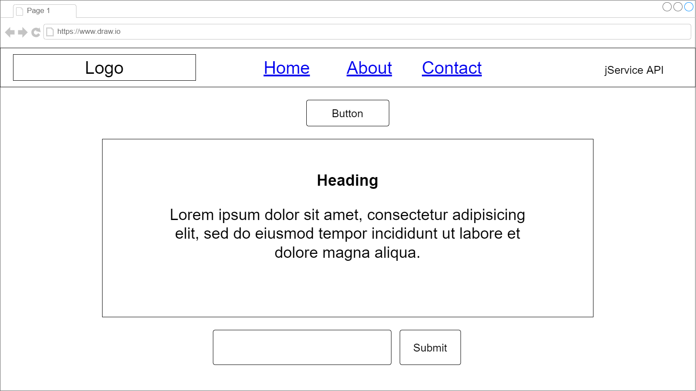
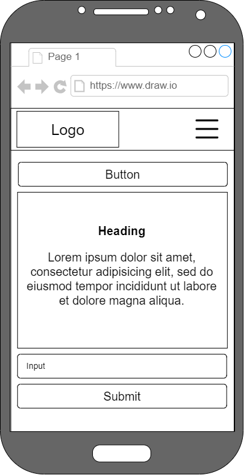

# Trivia Party! - A jService API Project by Grace Mills

## Hosting Link

[https://grace-mills.github.io/Trivia-Party/](https://grace-mills.github.io/Trivia-Party/)

## API Source

[jService API](http://jservice.io/)

## Description and Usage

The purpose of this project was to showcase my ability to connect to and utilize an API. Trivia Party utilizes the jService API, a collection of trivia questions from the show Jeopardy!. It allows users to answer each question by writing the answer in an input field. 

At the present moment, Trivia Party only accepts ***exact answers***, including articles (a, an, the); however, answers are case-insensitive. If you want to test the functionality of Trivia Party without having to guess, you can check the console where the exact answer is logged. 

## Technologies Used

- HTML
- CSS
- JavaScript

## User Stories

As a Jeopardy! fan, I want to play a similar trivia game so that I can test my knowledge of past Jeopardy! questions.

As a person who likes trivia, I want to play an online trivia game, so that I can relax and have fun. 

## Future Improvements

Future improvements I want to make to Trivia Party include adding a function that accepts approximate answers and doesn't require the article in each answer, adding a function that allows the game to automatically load after each answer is submitted, and adding features that allow users to search from specific categories or difficulties for questions. I would also like to add a multiple choice mode.

## Wireframes

